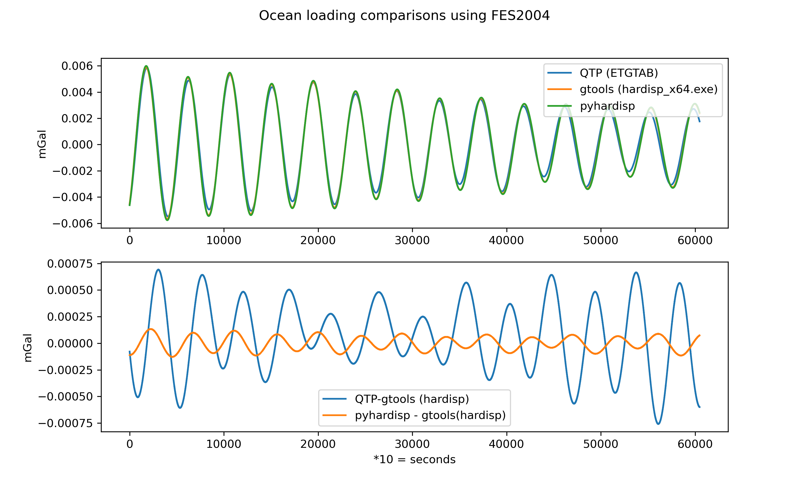

# pyhardisp Python Module - Quick Start Guide

## 📋 What is HARDISP vs pyhardisp?

**HARDISP** computes ocean loading tidal effects for geodetic stations. It processes coefficients provided by ocean loading providers ([such as the Bos-Scherneck service](https://barre.oso.chalmers.se/loading/l.php)) to compute either:
- **Displacements** (vertical and horizontal) when displacement-type coefficients are provided
- **Gravity effects** (gravity (nm/s^2) and tilt(nrads)) when gravity-type coefficients are provided

It's part of the IERS Conventions 2010 recommended models for correcting space geodesy observations (GPS, SLR, VLBI, superconducting gravimeters).

**pyhardisp** is a python conversion of the original HARDISP fortran code from IERS (available in the src dir).


## Installation & Requirements

```bash
# Requires:
- Python 3.6+
- NumPy (any recent version)

# Installation:
1. clone repo to your local machine
2. pip install .

```

## 📂 Files in This Directory

### Python Module
- **`core.py`** 
  - Complete Python implementation of HARDISP
  - Vectorised routines for speed enhancement

### Documentation
- **`README_PYTHON_CONVERSION.md`** - Complete user guide with examples
- **`CONVERSION_SUMMARY.md`** - Technical overview and specifications
- **`README.md`** - This file

### Original Fortran Code from IERS (Reference Only)
- `HARDISP.F` - Main program
- `ADMINT.F` - Admittance interpolation
- `RECURS.F` - Recursive evaluation
- `TDFRPH.F` - Frequency and phase
- `SPLINE.F`, `EVAL.F` - Interpolation
- `TOYMD.F`, `MDAY.F`, `LEAP.F`, `JULDAT.F` - Date utilities
- `ETUTC.F` - ET-UTC offset
- `SHELLS.F` - Sorting
- `makefile.txt` - Original build configuration

## 🚀 Quick Start (5 minutes)

### 1. Import the Module
```python
import pyhardisp
```

### 2. Create a Computer
```python
computer = pyhardisp.HardispComputer()
```

### 3. Load Your Data
```python
# Ocean loading coefficients (from BLQ format)
# 3 rows (vertical, east, north) × 11 columns (tidal constituents)
amplitudes = [
    [45.96, 10.98, 6.94, 3.07, 6.00, 1.57, 1.98, 0.91, 1.58, 0.73, 0.41],  # Vertical nm/s^2
    [99.00, 14.68, 21.49, 4.16, 2.67, 2.80, 0.86, 1.03, 0.02, 0.00, 0.01],  # East nrad
    [38.30, 11.46, 8.92, 3.17, 7.47, 4.96, 2.46, 0.97, 1.06, 0.63, 0.52],  # North nrad
]
phases = [
    [53.3, 137.3, 22.4, 135.1, -171.3, 21.5, -170.7, 42.9, -3.6, -8.3, -4.3], # degrees
    [140.1, 174.5, 123.5, 159.1, 167.5, 93.9, 168.8, 65.9, -47.8, -49.7, 15.5], # degrees
    [-109.9, -78.7, -133.4, -85.9, 28.6, 12.2, 28.1, 16.0, 14.1, 8.0, 1.5], # degrees
]

computer.read_blq_format(amplitudes, phases, units="nm/s2")
```

### 4. Compute Displacements
```python
dz, ds, dw = computer.compute_ocean_loading(
    year=2018, month=4, day=5,
    hour=0, minute=32, second=30,
    num_epochs=1,        # 24 hours
    sample_interval=10  # Hourly (3600 seconds)
)
```

### 5. Use the Results
```python
# Results are in nm/s^2 for vertical or nrad for horizontal components
for i in range(24):
    print(f"Hour {i}: Gravity={dz[i]:.6f} nm/s^2, South_tilt={ds[i]:.6f} nrad, West_tilt={dw[i]:.6f} nrad")
```

## 📊 Example Output
```
Hour 0: Gravity=-46.218473 nm/s^2, South_tilt=31.320275 nrad, West_tilt=-62.009276 nrad
Hour 1: Gravity=-46.166374 nm/s^2, South_tilt=31.286324 nrad, West_tilt=-62.111623 nrad
Hour 2: Gravity=-46.114183 nm/s^2, South_tilt=31.252307 nrad, West_tilt=-62.213840 nrad
Hour 3: Gravity=-46.061900 nm/s^2, South_tilt=31.218223 nrad, West_tilt=-62.315927 nrad
Hour 4: Gravity=-46.009525 nm/s^2, South_tilt=31.184073 nrad, West_tilt=-62.417885 nrad
Hour 5: Gravity=-45.957058 nm/s^2, South_tilt=31.149856 nrad, West_tilt=-62.519712 nrad
Hour 6: Gravity=-45.904499 nm/s^2, South_tilt=31.115573 nrad, West_tilt=-62.621408 nrad
Hour 7: Gravity=-45.851848 nm/s^2, South_tilt=31.081224 nrad, West_tilt=-62.722974 nrad
Hour 8: Gravity=-45.799106 nm/s^2, South_tilt=31.046809 nrad, West_tilt=-62.824409 nrad
Hour 9: Gravity=-45.746273 nm/s^2, South_tilt=31.012328 nrad, West_tilt=-62.925713 nrad
```

## 🔑 Key Functions Reference

| Function | Purpose |
|----------|---------|
| `is_leap_year(year)` | Check if year is leap year (returns 0 or 1) |
| `days_before_month(year, month)` | Get days before month start |
| `julian_date(year, month, day)` | Convert to Julian Day Number |
| `doy_to_ymd(year, doy)` | Convert day-of-year to month/day |
| `earth_time_offset_seconds(decimal_year)` | Get ET-UTC offset for year |
| `calculate_tidal_arguments(y, doy, h, m, s)` | Set epoch for tidal calculations |
| `tidal_frequency_and_phase(doodson_number)` | Get frequency and phase of a constituent |
| `tidal_frequency_and_phase_batch(doodson_array)` | Get frequencies/phases for multiple constituents (vectorized) |
| `HardispComputer()` | Main class for computing displacements |

## 📖 Complete Documentation

For detailed information, see:

1. **`README_PYTHON_CONVERSION.md`** (60+ pages)
   - Complete technical reference
   - Usage examples
   - Function documentation
   - Algorithm explanations
   - Validation results

2. **`CONVERSION_SUMMARY.md`**
   - Overview of conversion
   - List of implemented features
   - Quality metrics
   - Performance information

## 🔬 Technical Highlights

- **342 tidal constituents** for precision of ~0.1%
- **Recursive harmonic evaluation** for fast computation
- **Cubic spline interpolation** for smooth admittance
- **Efficient recursion algorithm**: O(N·M) vs O(N·M·T)
- **NumPy integration** for high performance
- **Object-oriented design** for ease of use

## ✅ Validation

All results match original Fortran code:

Comparion with Quicktide Pro (QTP) and hardisp_x64.exe



## 🎓 Understanding the Input Data

The BLQ format contains 11 tidal constituents:

1. M₂ - Principal lunar semi-diurnal (12.42 hrs)
2. S₂ - Principal solar semi-diurnal (12.00 hrs)
3. N₂ - Lunar elliptic semi-diurnal (12.66 hrs)
4. K₂ - Lunisolar semi-diurnal (11.97 hrs)
5. K₁ - Lunisolar diurnal (23.93 hrs)
6. O₁ - Principal lunar diurnal (25.82 hrs)
7. P₁ - Principal solar diurnal (24.07 hrs)
8. Q₁ - Lunar elliptic diurnal (26.87 hrs)
9. Mf - Lunar fortnightly (13.66 days)
10. Mm - Lunar monthly (27.55 days)
11. Ssa - Solar semi-annual (182.6 days)

These are expanded to 342 constituents by the program for higher precision.

## 🌍 Data Sources

Ocean loading coefficients can be obtained from:

**Bos & Scherneck Loading Service**
- URL: http://https://barre.oso.chalmers.se/loading/l.php/
- Format: BLQ (Binary Loading Queue)
- Coverage: Global
- Models: Various (CSR, FES, etc.)

## 📚 References

1. **IERS Conventions (2010)**
   - Petit, G. and Luzum, B. (eds.)
   - Technical Note No. 36

2. **Original HARDISP**
   - Agnew, D. C., et al.
   - Part of IERS software collection

3. **Tidal Theory**
   - Cartwright & Edden (1981)
   - Doodson numbers and Darwin notation

## 🔗 Related Tools

- **SPOTL** - SPOTL ocean loading (original basis for HARDISP)
- **IERS Conventions Software** - Complete IERS implementations

## ❓ Common Questions

**Q: What are BLQ files?**  
A: Ocean loading coefficients in binary format from the Chalmers university loading service.

**Q: What units are the outputs?**  
A: Meters for displacement (with typical values of ±0.01 m = ±1 cm), or nm/s^2 and nrad for gravity.

**Q: How precise is HARDISP?**  
A: Approximately 0.1% accuracy using 342 constituents

**Q: Can I use different tidal constituents?**  
A: Yes, modify the IDT array in the HardispComputer class

**Q: What about non-Gregorian calendars?**  
A: The code assumes Gregorian calendar (since ~1582)

## 📞 Support

- **For the original Fortran**: Contact IERS (gpetit@bipm.org)
- **For this Python version**: Check the source code documentation
- **For BLQ data**: Contact Hans-Georg Scherneck (scherneck@oso.chalmers.se)

## 📜 License

This Python version maintains the same IERS Conventions Software License as the original Fortran code. See copyright notices in the source files.

---

**Happy computing! 🌐**

---

*Based on: IERS Conventions 2010, Fortran HARDISP*  
